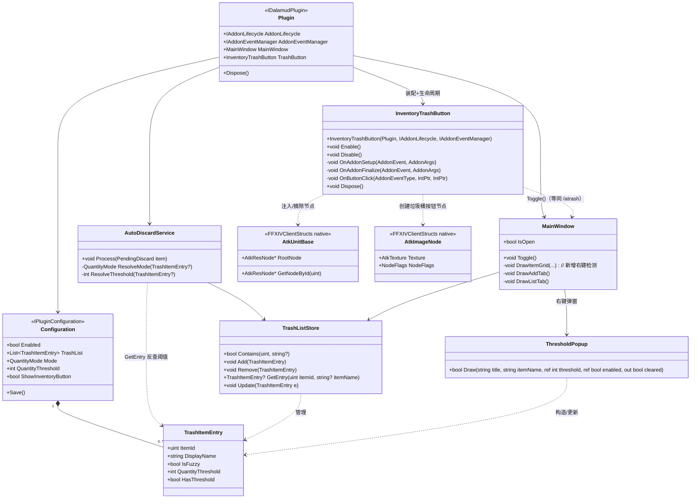
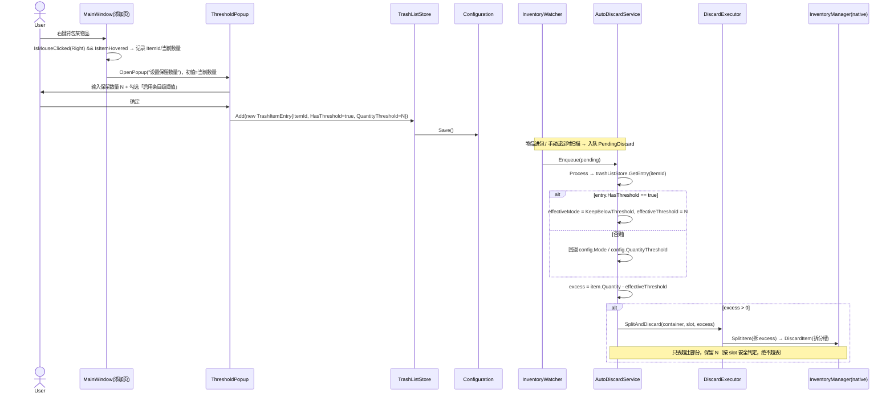
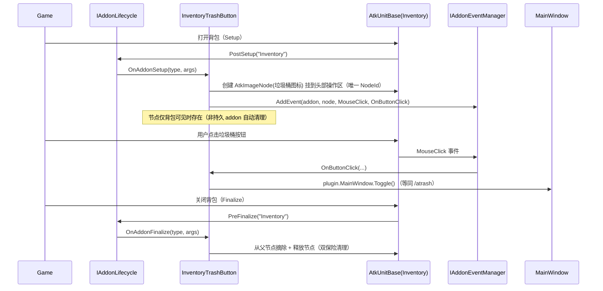
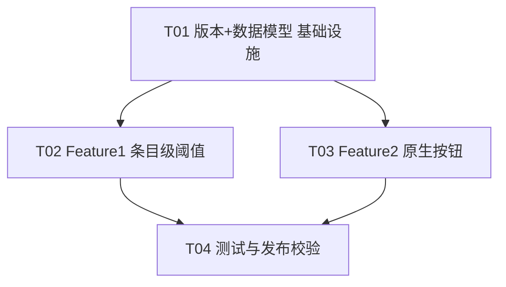

# AutoTrash 增量架构设计 + 任务分解（v1.0.2）

> 形态：**增量设计**（仅描述相对 v1.0.1 的两个新功能；复用既有自动丢弃主流程）
> 作者：架构师 高见远（Bob）｜ 基于 PM 许清楚《PRD-incremental-v1.0.2.md》与现有代码 `D:\deepseek\TrashCan\`
> 技术基线：C# / .NET 10 / Dalamud API 15 / FFXIVClientStructs / ImGui
> 命名空间：`AutoTrash`（子模块 `AutoTrash.Core` / `AutoTrash.Services` / `AutoTrash.Windows` / `AutoTrash.Models`）

---

## 0. 范围与亮点

| 功能 | 类型 | 核心改动 | 新增依赖 |
|------|------|----------|----------|
| **F1 条目级数量阈值** | 增量扩展 | `TrashItemEntry` 加字段 + 添加/列表页右键弹窗 + `AutoDiscardService.Process` 按条目取阈值（复用 `SplitAndDiscard`） | 无 |
| **F2 背包原生垃圾桶按钮** | 全新能力 | 新增 `Windows/NativeInventoryButton.cs`，经 `IAddonLifecycle`+`IAddonEventManager` 注入原生节点 | **无**（零新增 NuGet） |

两个功能均**不改动既有丢弃引擎与策略枚举**，回归风险低。

---

## 1. 实现方案 + 框架选型

### 1.1 Feature 1（条目级阈值）—— 复用为主，不新建任何原生调用

经核对 v1.0.1 源码（`AutoDiscardService.cs` / `DiscardExecutor.cs`）确认：

- **「保留 N、只丢超出」的核心能力已存在**：全局 `QuantityMode.KeepBelowThreshold` + `DiscardExecutor.SplitAndDiscard(container, slot, excess)`（`SplitItem` 拆出 excess → 仅丢拆分槽），结构上保证「只丢 excess、不超丢」。本次**直接复用**，不新写任何 `SplitItem`/`DiscardItem` 调用。
- **唯一新增**：
  1. `TrashItemEntry` 增加 `int QuantityThreshold` + `bool HasThreshold`；
  2. 添加/列表页**右键弹窗**输入阈值（ImGui）；
  3. `AutoDiscardService.Process` 按条目反查阈值：条目 `HasThreshold=true` → 走 `KeepBelowThreshold(entry.QuantityThreshold)` 语义；否则回退全局 `config.Mode`/`config.QuantityThreshold`。
- **旧列表零回归**：无该字段 → Newtonsoft 反序列化默认 `HasThreshold=false` → 走全局策略，行为不变。

### 1.2 Feature 2（背包原生按钮）—— **明确推荐：方案 A 手动 AtkUnitBase 节点注入**

| 维度 | **A) 手动 AtkUnitBase 钩子（推荐）** | B) KamiToolKit 单按钮 |
|------|--------------------------------------|------------------------|
| 依赖 | **零新增**（FFXIVClientStructs 已随 Dalamud 引入） | 新增 `KamiToolKit` NuGet，需随每次游戏补丁维护 |
| API 15 兼容 | `IAddonLifecycle` / `IAddonEventManager` 是一等公民服务（Dalamud 内核，随 API 升级） | 第三方库，补丁后常滞后/断裂（**这正是此前「背包网格」被否的根因**） |
| 生命周期安全 | `PostSetup` 注入 / `PreFinalize` 摘除释放；事件注册随插件卸载或 addon 关闭**自动清理** | 需自行 Dispose，刷新/重载易残留 |
| 点击检测 | `IAddonEventManager.AddEvent(addon, node, MouseClick, cb)` —— 原生事件，无需鼠标矩形轮询或原生 detour | 库内部封装，但仍是同一套底层钩子 |
| 观感 | `AtkImageNode` + 游戏自带垃圾桶图标 → 100% 原生观感 | 同样原生，但收益被依赖风险抵消 |
| 结论 | ✅ **采用** | ❌ 拒绝（单按钮场景下收益 < 维护风险，此前网格否决理由依然成立） |

**API 15 兼容性判断（已查证）**：
- `IAddonLifecycle`：提供 `RegisterListener(AddonEvent.PostSetup/PreFinalize, "Inventory", cb)` 与 `UnregisterListener`。`PostSetup` 在 addon 节点树初始化完成后触发，是注入节点的最佳时机；`PreFinalize` 在 addon 销毁前触发，用于摘除释放（**无 PostFinalize**）。
- `IAddonEventManager`：提供 `AddEvent(IntPtr addon, IntPtr node, AddonEventType.MouseClick, cb)` 返回 `IAddonEventHandle`；**插件卸载或 addon 关闭时事件自动移除**（对 `Inventory` 这类非持久 addon 无需手动 RemoveEvent，但本设计仍在 `PreFinalize` 主动清理以双重保险）。
- `AtkUnitBase` / `AtkImageNode` / `AtkResNode` / `AtkTexture` / `NodeFlags` / `IMemorySpace.GetUISpace()` 均位于 `FFXIVClientStructs.FFXIV.Component.GUI`，**已在现有 `csproj` 的 Dalamud 依赖链内**，无需新增包。
- `PostSetup` 回调参数 `AddonArgs.Addon` 即 `AtkUnitBase*` 地址，**无需再调 `GameGui.GetAddonByName`**（减少一次查找）。

> **裁定结论**：采用方案 A。`Plugin.cs` 仅新增两个 `[PluginService]` 注入（`IAddonLifecycle`、`IAddonEventManager`），其余全部为新增文件，对既有代码零侵入到「只加不改」级别（除 `Configuration` 增加一个可选开关字段）。

---

## 2. 文件列表及相对路径（仅变更 / 新增）

> 项目根：`D:\deepseek\TrashCan\`。标注 `改`=修改 `新`=新增 `不变`=仅上下文引用。

### 版本号与数据模型（T01 基础设施）
| 文件 | 动作 | 改什么 |
|------|------|--------|
| `Properties/AssemblyInfo.cs` | 改 | `AssemblyVersion`/`AssemblyFileVersion`/`AssemblyInformationalVersion` 由 `1.0.1.0` → `1.0.2.0`（窗口标题 `GetVersionString()` 自动取此值） |
| `auto_trash_can.csproj` | 改 | `<Version>`/`<AssemblyVersion>`/`<FileVersion>` 同步 `1.0.2.0`（保持一致，避免 `GenerateAssemblyInfo=false` 下的歧义） |
| `auto_trash_can.json` | 改 | `AssemblyVersion` → `1.0.2.0`；`Description` 补一句「背包原生垃圾桶按钮」 |
| `Models/TrashItemEntry.cs` | 改 | 新增 `int QuantityThreshold`（默认 0）、`bool HasThreshold`（默认 false）、`[JsonIgnore]` 不需要（JSON 自动兼容缺字段）；新增便捷构造函数 / 属性初始化 |

### Feature 1 条目级阈值（T02）
| 文件 | 动作 | 改什么 |
|------|------|--------|
| `Services/TrashListStore.cs` | 改 | 新增 `TrashItemEntry? GetEntry(uint itemId, string? itemName)`（与 `Contains` 同匹配优先级：精确 ItemId / 模糊子串回退）；新增 `void Update(TrashItemEntry e)`（原地改字段后 `config.Save()`） |
| `Services/AutoDiscardService.cs` | 改 | `Process` 内：先用 `GetEntry` 反查条目阈值；`HasThreshold` 时 `effectiveMode=KeepBelowThreshold`、`effectiveThreshold=entry.QuantityThreshold`，否则回退 `config.Mode`/`config.QuantityThreshold`；switch 改用 `effective*`（**不超丢**） |
| `Core/ImportExport.cs` | 改 | CSV 表头追加 `QuantityThreshold,HasThreshold`（P2，向后兼容：旧 CSV 缺列→默认 0/false）；JSON 无需改（Newtonsoft 自动忽略缺字段） |
| `Windows/MainWindow.cs` | 改 | 添加页 `DrawItemGrid` 增加右键检测（`IsMouseClicked(Right)&&IsItemHovered`）→ 打开阈值弹窗；列表页右键 → 同弹窗（改/清阈值）；列表页 tooltip 显示「保留 N」 |
| `Windows/ThresholdPopup.cs` | 新 | 可复用模态弹窗：输入保留数量 + 勾选启用 + 「清除阈值」按钮；供添加页/列表页共用 |
| `Windows/UiHelpers.cs` | 改 | 新增「右键物品可设置保留数量」提示（P1-F1）辅助方法 |

### Feature 2 背包原生按钮（T03）
| 文件 | 动作 | 改什么 |
|------|------|--------|
| `Windows/NativeInventoryButton.cs` | 新 | `InventoryTrashButton` 类：生命周期钩子 + 原生节点注入 + 点击回调（详见 §3） |
| `Plugin.cs` | 改 | 新增 `[PluginService] IAddonLifecycle` / `IAddonEventManager`；实例化并装配 `InventoryTrashButton`；`Dispose` 中 `Disable()` 清理 |
| `Configuration.cs` | 改 | 新增 `bool ShowInventoryButton`（默认 true）—— 用户可彻底关闭按钮（Q-U-3 兜底；与 `Enabled` 解耦） |

### 测试与发布校验（T04）
| 文件 | 动作 | 改什么 |
|------|------|--------|
| `TrashCan.Tests/QuantityThresholdTests.cs` | 新 | 覆盖：条目阈值优先于全局、只丢超出、多槽位按 slot 不超丢、HQ/装备保护仍生效 |
| `TrashCan.Tests/TrashListStoreTests.cs` | 改 | 补 `GetEntry` / `Update` 用例（含模糊匹配回退） |
| `TrashCan.Tests/TestStubs.cs` | 改 | 桩支持 `HasThreshold`/`QuantityThreshold` 字段 |

---

## 3. 数据结构与接口（类图）



**关键设计说明**：
- `TrashItemEntry` 新增字段均用**默认值**（`QuantityThreshold=0`、`HasThreshold=false`），旧配置反序列化自动兼容，零回归。
- `AutoDiscardService` 新增两个私有解析方法 `ResolveMode`/`ResolveThreshold`：`HasThreshold` 真 → 强制 `KeepBelowThreshold` + 条目阈值；否则回退全局。复用既有 switch 与 `SplitAndDiscard`，**不新增原生调用**。
- `InventoryTrashButton` 为全新类，公开方法仅 `Enable()`/`Disable()`/`Dispose()`；具体钩子/点击回调为 `private`，由 `Plugin` 在构造后 `Enable()`、卸载前 `Disable()`。
- `ShowInventoryButton`（默认 true）仅在 `InventoryTrashButton.Enable()` 时判断是否注册，满足 Q-U-3「可彻底关闭按钮」且「按钮打开窗口始终与 `Enabled` 解耦」。

---

## 4. 程序调用流程（时序图）

### 4.1 右键输入阈值 → 加项 → Process 按条目阈值丢弃



### 4.2 背包打开 → 注入按钮 → 点击 → 打开主窗口



---

## 5. 任务列表（有序 · 含依赖 · 按实现顺序）

> 遵循「≤5 任务、每任务 ≥3 文件、首任务为基础设施」原则，按功能模块分组，依赖图尽量扁平。

| 任务 | 名称 | 产出文件 | 依赖 | 优先级 |
|------|------|----------|------|--------|
| **T01** | 版本号同步 + 条目数据模型（基础设施） | `Properties/AssemblyInfo.cs`、`auto_trash_can.csproj`、`auto_trash_can.json`、`Models/TrashItemEntry.cs` | — | P0 |
| **T02** | Feature 1 条目级阈值（引擎 + UI 全链路） | `Services/TrashListStore.cs`、`Services/AutoDiscardService.cs`、`Core/ImportExport.cs`、`Windows/MainWindow.cs`、`Windows/ThresholdPopup.cs`、`Windows/UiHelpers.cs` | T01 | P0 |
| **T03** | Feature 2 背包原生垃圾桶按钮 | `Windows/NativeInventoryButton.cs`、`Plugin.cs`、`Configuration.cs` | T01 | P0 |
| **T04** | 测试与发布校验 | `TrashCan.Tests/QuantityThresholdTests.cs`、`TrashCan.Tests/TrashListStoreTests.cs`、`TrashCan.Tests/TestStubs.cs` | T02, T03 | P1 |

**任务说明**：
- **T01**：升版本号三处（AssemblyInfo / csproj / json）至 `1.0.2.0`；`TrashItemEntry` 增加 `QuantityThreshold`/`HasThreshold` 字段（默认值，JSON 自动兼容）；`json.Description` 补原生按钮说明。
- **T02**：`TrashListStore.GetEntry/Update` → `AutoDiscardService.Process` 按条目阈值解析（复用 `SplitAndDiscard`）→ `ImportExport` CSV 加列 → `MainWindow` 添加/列表页右键弹窗 + tooltip → 新增 `ThresholdPopup` 复用弹窗 → `UiHelpers` 右键提示。
- **T03**：新增 `InventoryTrashButton`（PostSetup 注入 AtkImageNode + PreFinalize 清理 + MouseClick→`MainWindow.Toggle()`）；`Plugin` 注入 `IAddonLifecycle`/`IAddonEventManager` 并装配、`Dispose` 清理；`Configuration` 加 `ShowInventoryButton`。
- **T04**：新增条目阈值单测、扩展 `GetEntry` 测试、桩支持新字段；并做发布前自检（版本号三处一致、`/atrash` 与按钮行为一致、旧配置导入无回归）。

### 9. 任务依赖图



---

## 6. 依赖包列表

**Feature 1 & Feature 2 均零新增 NuGet 依赖。**

```
- Dalamud            (Goatcorp) : 插件框架 + IAddonLifecycle / IAddonEventManager / IGameInventory / IFramework（API 15 服务）
- Dalamud.Interface  (Goatcorp) : ImGui 绑定、ITextureProvider
- FFXIVClientStructs (随 Dalamud): AtkUnitBase / AtkImageNode / AtkResNode / AtkTexture / NodeFlags / IMemorySpace（方案 A 所需，已在依赖链内）
```

- ❌ **不引入 KamiToolKit**（Feature 2 方案 B 被否决；理由见 §1.2）。
- 既有 `Newtonsoft.Json`、`Lumina` 继续复用，无需变更。

---

## 7. 共享约定（跨文件）

- **阈值字段命名（统一）**：`int QuantityThreshold`（保留数量，默认 0）、`bool HasThreshold`（是否启用条目级阈值，默认 false）。禁止拼写变体。
- **阈值语义（统一）**：`HasThreshold=true` 恒等于「`KeepBelowThreshold` + `QuantityThreshold`」；**不支持**条目级 `DiscardAboveThreshold`/`DiscardAll`（P2 再说）。回退全局时完全沿用 `config.Mode`/`config.QuantityThreshold`。
- **右键交互约定**：
  - 添加页：右键格子 → 弹「设置保留数量」；确定 → 以 `HasThreshold=true` 加入（如已存在则改为更新阈值）；取消 → 不操作。
  - 列表页：右键已列条目 → 同弹窗（预填当前阈值）；提供「清除阈值」按钮（置 `HasThreshold=false`，保留在列表）。
  - 弹窗初值 = 该物品**当前背包数量**（即先「不丢」，由用户下调），见 Q-F1-4。
- **按钮清理约定（Feature 2）**：注入在 `PostSetup`、摘除+释放节点在 `PreFinalize`；用**唯一 NodeId**（如 `990001`）避免与原生节点冲突、并作为「已注入」去重标记（刷新/重排时防重复注入）；`Plugin.Dispose` 必走 `InventoryTrashButton.Disable()` 双保险。
- **点击回调约定（Feature 2）**：按钮点击 = `plugin.MainWindow.Toggle()`，与 `/atrash` **行为完全一致**（切换打开/关闭）；与 `Configuration.Enabled` 解耦——无论是否启用自动丢弃，点击都打开窗口。
- **版本号三处同步（硬性）**：`Properties/AssemblyInfo.cs`（AssemblyVersion/FileVersion/InformationalVersion）、`auto_trash_can.csproj`（Version/AssemblyVersion/FileVersion）、`auto_trash_can.json`（AssemblyVersion）必须同为 `1.0.2.0`；窗口标题由 `GetVersionString()` 自动读取 AssemblyVersion，无需改代码。外部 `pluginmaster.json`（仓库 `ijnokmsc/DalamudPlugins`）由发布流程单独同步。
- **线程约定（沿用）**：任何原生 `InventoryManager`/`Atk*` 操作仍仅在主线程（`IFramework.Update` 或 `AddonLifecycle`/`AddonEventManager` 回调，后者本就在主线程）执行。
- **注入目标 addon 名（可配置常量）**：`InventoryTrashButton` 内以 `const string TargetAddonName = "Inventory"` 形式定义，便于实测后一键切换（`InventoryGrid` / `InventoryExpansion` 等候选）。

---

## 8. 待明确事项（对 PRD §6 的裁定）

### 8.1 已裁定（架构师决策，无需回抛用户）

| 问题 | 裁定 | 理由 |
|------|------|------|
| **Q-F1-1** 条目字段是否够 | 仅 `QuantityThreshold`+`HasThreshold`，**不做**条目级 `QuantityMode`（模式多样化留 P2） | 满足 v1.0.2 需求，最小字段、零回归 |
| **Q-F1-2** Process 改法 / 是否加 `GetEntry` | 新增 `TrashListStore.GetEntry(uint, string?)`（与 `Contains` 同优先级回退），列表通常 < 数百，O(n) 反查开销可忽略 | 解耦 Process 与列表细节 |
| **Q-F1-3** 多槽位聚合 | **维持按 slot 独立判定**（安全优先）；同物多槽位可能留多于 N，聚合列为后续增强 | PRD 架构约束明确；`SplitAndDiscard` 本就按 slot 算 excess |
| **Q-F1-4** 右键初值 | 初值 = 该物品**当前背包数量**（先不丢，用户下调） | 最贴近「保留 N」心智，避免误设 0 导致整堆丢 |
| **Q-F2-2** 注入选型 | **方案 A 手动 AtkUnitBase 钩子**，零新增依赖 | 见 §1.2，KamiToolKit 风险依旧不成立 |
| **Q-U-1** 是否需「超 N 整堆丢」条目级模式 | 否，仅「保留 N」 | 同 Q-F1-1 |

### 8.2 仍建议实测确认（非阻塞，已用常量/兜底封装，不阻塞 Engineer 开工）

| 项 | 说明 | 设计中的应对 |
|----|------|--------------|
| **Q-F2-1** 注入目标 addon 与节点锚点 | 主背包 addon 名（`Inventory`/`InventoryGrid` 等）及头部操作区父节点 NodeId，需在游戏内用 Dalamud 的「Native UI」调试树确认 | `TargetAddonName` 常量 + 锚点 NodeId 通过 `GetNodeById` 定位，改一处常量即可 |
| **垃圾桶图标 ID** | 选用游戏自带「垃圾桶/回收」图标的具体 `IconId`/`Crc`，需实测确认最贴近的图标 | 以 `const uint TrashIconId` 常量定义；`AtkImageNode.Texture` 用 `AtkTexture` 引用该图标（运行时确认接线细节） |
| **Q-U-2** 扩充背包是否也注入 | 默认仅主背包 `Inventory`；扩充/鞍袋页暂不注入（避免布局冲突） | 如需扩展，复制一份 `InventoryTrashButton` 注册另一个 addon 名即可 |
| **Q-U-3** 按钮与 Enabled 关系 | 按钮点击始终打开窗口（与 `Enabled` 解耦）；新增 `ShowInventoryButton` 开关可彻底隐藏 | 已实现解耦 + 显式开关 |
| **CSV 阈值列（P2-F1）** | 表头加 `QuantityThreshold,HasThreshold`；旧 CSV 缺列默认 0/false | `ImportExport` 已纳入 T02，向后兼容 |

> 上述 4 项均属「游戏内运行期验证细节」，不影响架构自洽与工程师开工；代码中以 `const`/可配置锚点封装，实测后改常量即可，无需重构。

---

## 附：关键 API 参考（Feature 2，API 15 已查证）

- `IAddonLifecycle.RegisterListener(AddonEvent.PostSetup, "Inventory", OnPostSetup)` / `UnregisterListener(...)`
- `IAddonEventManager.AddEvent(IntPtr addon, IntPtr node, AddonEventType.MouseClick, AddonEventHandler)` → `IAddonEventHandle`
- `AddonArgs.Addon`（`IntPtr` → `(AtkUnitBase*)`）在 `PostSetup` 直接可用，无需 `GetAddonByName`
- `addon->GetNodeById(uint)` 定位原生节点；自创节点用 `IMemorySpace.GetUISpace()->Create<AtkImageNode>()`，置 `NodeId`/`NodeFlags`（含 `EmitsEvents|RespondToMouse|HasCollision`）后挂到父节点
- 非持久 addon（`Inventory`）的事件注册在 addon 关闭/插件卸载时**自动移除**；`PreFinalize` 仍主动摘除释放节点做双保险

---

## IS_PASS 自检

- **设计自洽**：F1 复用 `SplitAndDiscard`、F2 复用 `MainWindow.Toggle()`，均不新建丢弃/打开逻辑；新增字段默认值保证旧配置零回归；依赖图 T01→(T02,T03)→T04 扁平无环。
- **依赖完整**：零新增 NuGet；所需 `IAddonLifecycle`/`IAddonEventManager`/`Atk*` 皆在现有 Dalamud/FFXIVClientStructs 链内；`Plugin` 已规划服务注入与 `Dispose` 清理。
- **可直接交工**：文件清单、类图、两条时序图、4 任务（含优先级/依赖）、共享约定、待确认项均已给出；仅 4 项运行期验证细节以常量封装，不阻塞实现。
