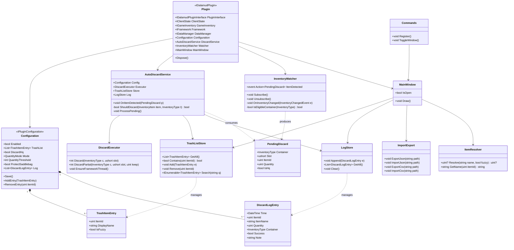
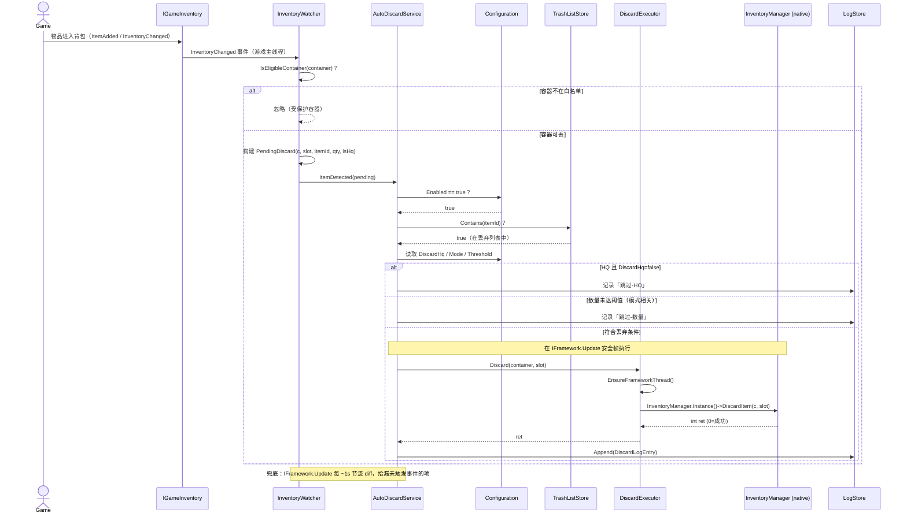

# 自动丢弃垃圾桶（Auto-Trash）插件 · 架构设计 + 任务分解

> 项目名：`auto_trash_can` ｜ 语言/框架：C# / .NET 10 / Dalamud API 15 / ImGui
> 命名空间：`AutoTrash` ｜ 文档版本：v1（架构设计稿）
> 作者：架构师 高见远（Gao）｜ 基于产品 PRD（许清楚）产出

---

## 一、实现方案 + 框架选型（含研究结论与引用来源）

### 1.1 技术难点

1. **无确认丢弃**：需要直接调用游戏底层丢弃函数，绕过「右键→丢弃→确认」的 UI 流程。
2. **背包变更感知**：需在物品进入背包的瞬间触发检测，且不能每帧全量扫描造成性能损耗。
3. **容器边界**：必须精确区分「可自动丢弃的容器」与「受保护容器」，避免误丢公司仓库/军武库等物品。
4. **线程安全**：调用游戏原生函数必须在游戏主线程（Framework 更新帧）执行，否则崩溃。

### 1.2 框架与库选型

| 组件 | 选型 | 理由 |
|------|------|------|
| 插件框架 | **Dalamud API 15**（自带 FFXIVClientStructs、Lumina、ImGui） | PRD 指定，API 15 含 `IGameInventory` 事件 |
| 原生互操作 | **FFXIVClientStructs**（随 Dalamud 分发，无需额外 NuGet） | 提供 `InventoryManager.DiscardItem` 等原生封装 |
| 物品数据 | **Lumina**（`IDataManager.GetExcelSheet<Item>()`） | 查物品名/Icon，实现按名添加与模糊匹配 |
| UI | **ImGui**（Dalamud.Interface 内置 `ImGuiScene` 在 IL2CPP 版本不可用，故用 ImGui 直接绘制） | PRD 指定 |
| 配置持久化 | `IDalamudPluginInterface.GetPluginConfig<T>()` / `SavePluginConfig()` | Dalamud 自动 JSON 序列化到插件配置目录 |

### 1.3 🔬 关键研究结论（已实际查证，基于 API 15）

#### 结论 1：无确认丢弃函数 —— `InventoryManager.DiscardItem`

**查证来源**：FFXIVClientStructs 官方 API 文档（`ffxiv.wildwolf.dev/api/...InventoryManager.html`）+ 源码 `FFXIVClientStructs/FFXIV/Client/Game/InventoryManager.cs`（raw.githubusercontent.com/Theoretical/FFXIVClientStructs）。

**准确签名**（当前 FFXIVClientStructs，Dawntrail 7.x / API 15 对应版本）：

```csharp
// 命名空间：FFXIVClientStructs.FFXIV.Client.Game
// 返回 int：0 = 成功，非 0 = 失败（如物品不可丢弃、容器受限等）
public unsafe int DiscardItem(InventoryType container, ushort slot);
```

调用方式（在游戏主线程 unsafe 块内）：

```csharp
var mgr = InventoryManager.Instance();
int ret = mgr->DiscardItem(container, slot);
```

> ⚠️ **重要纠偏**：PRD 中猜测的 `DiscardItem(InventoryType, uint slot, uint amount)` **已过时/不准确**。当前版本**没有 amount 参数**，即 `DiscardItem` 一次性丢弃该槽位中的**整堆**物品。要实现「只丢到剩 N 个」（P1-3），需先调用 `InventoryManager.SplitItem(InventoryType, ushort slot, int quantity)` 把要丢的数量拆到新槽，再对新槽 `DiscardItem`（详见 §三 与 §四）。

> **能否绕过确认弹窗？** 能。`DiscardItem` 正是游戏在用户点「确认」后 UI 层内部调用的底层函数；直接调用它不经 UI/确认对话框。但也意味着没有任何二次确认 —— 这正是本插件「无确认自动丢弃」需求所需的函数。

#### 结论 2：背包变更检测（API 15）—— 事件驱动为主 + 轮询兜底

**查证来源**：Dalamud `IGameInventory` 接口文档（`dalamud.dev/api/Dalamud.Plugin.Services/Interfaces/IGameInventory`）。

Dalamud API 11 起提供 `IGameInventory` 服务，包含：

- `event IGameInventory.InventoryChangedDelegate InventoryChanged` —— 物品变更（已做 move/merge/split 解释）
- `event IGameInventory.InventoryChangelogDelegate InventoryChangedRaw` —— 原始变更日志（不做解释，适合精确 diff）
- `event ... ItemAdded / ItemRemoved / ItemChanged / ItemMoved` 等细分事件

**推荐方案**：
- **主路径**：订阅 `IGameInventory.InventoryChanged`（或 `InventoryChangedRaw`），物品进入背包即触发，零轮询开销。
- **兜底**：在 `IFramework.Update` 中做 ~1s 节流的全量 diff（`GetInventoryItemCount` 或遍历容器），防止个别边缘情况下事件丢失。
- 丢弃动作统一收敛到 `IFramework.Update` 安全帧执行（见结论 4）。

#### 结论 3：容器类型枚举（`InventoryType`）—— 区分可丢 / 受保护

**查证来源**：`ffxiv.wildwolf.dev` Enum `InventoryType` + `InventoryManager.cs` 源码。

关键枚举值（节选）：

| 分类 | 枚举值 | 数值 | v1 默认 |
|------|--------|------|---------|
| **主背包** | `Inventory1`~`Inventory4` | 0–3 | ✅ 自动丢弃 |
| **可交易随身袋（鞍袋）** | `SaddleBag1`,`SaddleBag2` | 4000,4001 | ✅ 自动丢弃（按 PRD Q4，待用户确认） |
| **豪华随身袋** | `PremiumSaddleBag1`,`PremiumSaddleBag2` | 4100,4101 | ✅ 自动丢弃（按 PRD Q4，待用户确认） |
| 装备中 | `EquippedItems` | 1000 | ⛔ 保护 |
| 货币 / 水晶 | `Currency`,`Crystals` | 2000,2001 | ⛔ 保护 |
| 邮件 / 关键道具 | `Mail`,`KeyItems` | 2003,2004 | ⛔ 保护 |
| 军武库（全身） | `ArmoryOffHand`~`ArmoryMainHand` 等 | 3200–3500 | ⛔ 保护 |
| 公司仓库 | `FreeCompanyPage1`~`5`,`FreeCompanyGil`,`FreeCompanyCrystals` | 20000–22001 | ⛔ 保护 |
| 雇员背包 | `RetainerPage1`~`7`,`RetainerGil`,`RetainerCrystals`,`RetainerMarket` | 10000–12002 | ⛔ 保护 |
| 房屋仓库（内外/外仓） | `HousingInterior*`,`HousingExterior*`,`*Storeroom` | 25000–27008 | ⛔ 保护 |
| 其他（回收/交付/鉴定/外观） | `Reclaim`,`HandIn`,`Examine`,`DamagedGear` 等 | 2005–2013 | ⛔ 保护 |

> **判定规则**：`IsEligibleContainer(t)` = `t ∈ {Inventory1..4, SaddleBag1, SaddleBag2, PremiumSaddleBag1, PremiumSaddleBag2}`。其余一律保护（v1 默认「白名单」策略，最安全）。

#### 结论 4：安全执行点 —— 必须在游戏主线程（Framework 帧）

**查证来源**：Dalamud `IFramework` 文档（`mintlify.wiki/goatcorp/dalamud/api/services/iframework`、`.../game/framework`）。

- `IFramework.Update` 事件**在游戏主线程每帧触发**。
- `IFramework.IsInFrameworkUpdateThread` 可判断当前是否已在主线程。
- 若不在主线程，用 `framework.RunOnFrameworkThread(() => ...)` 或 `framework.Run(...)` 切回主线程再调用原生函数。
- `IGameInventory.InventoryChanged` 事件本身即在游戏主线程派发，但为稳妥与节流，所有 `DiscardItem` 调用统一在 `IFramework.Update` 的节流逻辑中执行。

> **结论**：丢弃函数只在 `IFramework.Update` 回调（或 `RunOnFrameworkThread` 封装）内调用，绝对不在任意后台线程直接调用。

---

## 二、文件列表及相对路径

项目根：`D:\deepseek\TrashCan\`

```
D:\deepseek\TrashCan\
├── auto_trash_can.csproj          # 项目文件（net10.0 + Dalamud/Dalamud.Interface）
├── auto_trash_can.json            # DalamudPlugin.json（插件清单）
├── Plugin.cs                      # 插件入口（[PluginService] 注入）
├── Configuration.cs               # 配置类（IPluginConfiguration，持久化）
├── Models/
│   ├── TrashItemEntry.cs          # 待丢弃条目（ItemId + 显示名）
│   └── DiscardLogEntry.cs         # 丢弃日志条目
├── Core/
│   ├── Constants.cs               # 容器白名单、丢弃策略常量
│   ├── ItemResolver.cs           # Lumina 物品名→ItemId（含模糊匹配）
│   └── ImportExport.cs            # 列表 JSON/CSV 导入导出
├── Services/
│   ├── InventoryWatcher.cs        # 背包变更监听（事件 + 轮询兜底）
│   ├── AutoDiscardService.cs      # 丢弃编排 + 规则判定
│   ├── DiscardExecutor.cs         # 原生 DiscardItem 调用（线程安全）
│   ├── TrashListStore.cs          # 列表增删查（ backed by Configuration）
│   └── LogStore.cs                # 丢弃日志存取/清空
└── Windows/
    ├── MainWindow.cs              # ImGui 主窗口（列表/设置/日志 Tab）
    ├── Commands.cs                # /atrash 命令与窗口开关
    └── UiHelpers.cs               # 共享 ImGui 辅助（图标绘制等）
```

---

## 三、数据结构与接口（类图）



**枚举补充**：

```csharp
public enum QuantityMode : byte
{
    DiscardAll = 0,          // 见即丢（整堆）
    DiscardAboveThreshold,   // 仅当数量 > Threshold 时整堆丢
    KeepBelowThreshold       // 只丢到剩 Threshold 个（先 Split 再丢）
}
```

---

## 四、程序调用流程（时序图）

物品进包 → 检测 → 规则判定 → 丢弃 → 记录：



**部分数量丢弃（KeepBelowThreshold）补充流程**：
`DiscardExecutor.DiscardPartial(c, slot, keep)`：
1. `mgr->SplitItem(c, slot, (int)(qty - keep))` 把「要丢的数量」拆到新槽；
2. 重新读取容器找到拆分产生的新槽 `newSlot`；
3. `mgr->DiscardItem(c, newSlot)` 丢弃拆分槽。

---

## 五、任务列表（有序 · 含依赖 · 按实现顺序）

> 遵循「最多 5 个任务、每任务 ≥3 文件、首个任务为基础设施」的分解原则，按架构层次分组。

| 任务 | 名称 | 产出文件 | 依赖 | 优先级 |
|------|------|----------|------|--------|
| **T01** | 项目基础设施与配置 | `auto_trash_can.csproj`、`auto_trash_can.json`、`Plugin.cs`、`Configuration.cs` | — | P0 |
| **T02** | 数据模型与物品解析 | `Models/TrashItemEntry.cs`、`Models/DiscardLogEntry.cs`、`Core/ItemResolver.cs` | T01 | P0 |
| **T03** | 列表存储与导入导出 | `Services/TrashListStore.cs`、`Services/LogStore.cs`、`Core/ImportExport.cs` | T01, T02 | P0（列表为 P0-1，导入导出为 P2-1） |
| **T04** | 监控与丢弃引擎 | `Services/InventoryWatcher.cs`、`Services/AutoDiscardService.cs`、`Services/DiscardExecutor.cs` | T01, T02, T03 | P0 |
| **T05** | 用户界面与命令集成 | `Windows/MainWindow.cs`、`Windows/Commands.cs`、`Windows/UiHelpers.cs` | T01–T04 | P0 |

**任务说明**：
- **T01**：搭建 `csproj`（net10.0 + Dalamud/Dalamud.Interface 引用）、`auto_trash_can.json` 清单、`Plugin.cs`（无参构造函数 + `[PluginService]` 静态注入 `IDalamudPluginInterface`/`IClientState`/`IGameInventory`/`IFramework`/`IDataManager`）、`Configuration.cs`（实现 `IPluginConfiguration`，含 `Save()` 与全局开关/列表/策略字段）。
- **T02**：定义 `TrashItemEntry`/`DiscardLogEntry`；`ItemResolver` 用 Lumina `ItemSheet` 实现「按名→ItemId」与模糊匹配（P1-4）。
- **T03**：`TrashListStore`（增/删/查/搜索，直接读写 `Configuration.TrashList`）、`LogStore`（日志环形/上限存取与清空，P1-1）、`ImportExport`（JSON/CSV，P2-1）。
- **T04**：`InventoryWatcher`（订阅 `IGameInventory.InventoryChanged` + `IFramework.Update` 轮询兜底，产出 `PendingDiscard`）、`AutoDiscardService`（规则判定：总开关/HQ/数量/容器/受保护，节流调度）、`DiscardExecutor`（线程安全的原生 `DiscardItem` 调用，含 `DiscardPartial`）。
- **T05**：`MainWindow`（ImGui：列表管理 Tab + 设置 Tab + 日志 Tab + 导入导出按钮）、`Commands`（`/atrash` 开关窗口）、`UiHelpers`（图标绘制等复用）。

---

## 六、依赖包列表

无需额外 NuGet —— FFXIVClientStructs、Lumina、ImGui 均随 Dalamud 分发。

```
- Dalamud            (Goatcorp)  : 插件框架 + FFXIVClientStructs + IGameInventory/IFramework 等 API 15 服务
- Dalamud.Interface  (Goatcorp)  : ImGui 绑定、纹理/图标、IPluginLog
```

`auto_trash_can.csproj` 关键片段：

```xml
<PropertyGroup>
  <TargetFramework>net10.0</TargetFramework>
  <LangVersion>latest</LangVersion>
</PropertyGroup>
<ItemGroup>
  <PackageReference Include="Dalamud" Version="15.*" />
  <PackageReference Include="Dalamud.Interface" Version="15.*" />
</ItemGroup>
```

---

## 七、共享知识（跨文件约定）

- **命名空间**：统一 `AutoTrash`（子模块 `AutoTrash.Models` / `AutoTrash.Core` / `AutoTrash.Services` / `AutoTrash.Windows`）。
- **服务注入**：插件入口用 `[PluginService]` 静态属性注入，构造函数无参：
  ```csharp
  [PluginService] internal static IDalamudPluginInterface PluginInterface { get; set; } = null!;
  [PluginService] internal static IGameInventory GameInventory { get; set; } = null!;
  [PluginService] internal static IFramework Framework { get; set; } = null!;
  [PluginService] internal static IDataManager DataManager { get; set; } = null!;
  [PluginService] internal static IClientState ClientState { get; set; } = null!;
  ```
- **配置类结构**：`Configuration : IPluginConfiguration`，字段见 §三类图；`Save()` 调 `PluginInterface.SavePluginConfig(this)`；加载用 `PluginInterface.GetPluginConfig<Configuration>() ?? new()`。
- **日志约定**：丢弃失败/跳过统一写入 `LogStore`（内存 + 持久化于 Configuration.Log）；运行期调试用 `Services.PluginLog.Information/Warning`。日志条目字段见 `DiscardLogEntry`。
- **线程约定**：任何 `InventoryManager.Instance()->*` 原生调用都必须在 `IFramework.Update` 回调或 `Framework.RunOnFrameworkThread(...)` 内执行。
- **容器白名单**：判定逻辑集中在 `Core/Constants.cs` 的 `IsEligibleContainer(InventoryType)`，遵循 §1.3 结论 3 的白名单。
- **全局开关**：`Configuration.Enabled` 为总开关（P0-4）；关闭时 `AutoDiscardService` 直接 return。

---

## 八、已裁定的待确认问题默认值（Q1–Q6）

| 问题 | v1 默认值 | 一句话理由 |
|------|-----------|-----------|
| **Q1 触发时机** | 事件驱动（`IGameInventory.InventoryChanged`）+ ~1s 轻量轮询兜底；丢弃统一在 `IFramework.Update` 安全帧执行 | 事件保证实时、轮询防丢、安全帧避免跨线程崩溃 |
| **Q2 确认绕过安全性** | 直接调用 `DiscardItem`（绕过 UI 确认）；仅在主线程/非加载过场、节流（≥1 次/帧、间隔建议 ≥150ms）执行；插件内明确「使用风险自担」免责声明 | `DiscardItem` 即游戏确认后的底层函数；节流+安全态降低异常模式被风控关注的概率 |
| **Q3 HQ 策略** | 默认**不丢弃 HQ**（`DiscardHq=false`），提供开关 | HQ 通常更有价值，误操作损失大 |
| **Q4 跨容器保护** | 仅对 `Inventory1–4` + 鞍袋/豪华鞍袋（`SaddleBag1/2`、`PremiumSaddleBag1/2`）自动丢弃；其余（公司仓库/军武库/邮件/关键道具/房屋仓库/装备中等）全部保护 | 遵循 PRD Q4「白名单」建议，最小化误丢风险 |
| **Q5 数量策略** | 默认「见即丢」（整堆）；提供 `DiscardAboveThreshold`（>N 才丢）与 `KeepBelowThreshold`（只丢到剩 N）两模式 | 满足 P1-3；无 amount 参数故部分丢弃走 `SplitItem`+`DiscardItem` |
| **Q6 边界处理** | 物品不可丢弃（`DiscardItem` 返回非 0，如绑定中/装备中/邮寄中/交易中）时**跳过、不重试、记日志** | 避免反复尝试导致卡顿/异常 |

### 仍建议用户最终确认的点
1. **鞍袋/豪华鞍袋是否纳入自动丢弃**（Q4）—— 部分用户不希望动鞍袋，建议默认 ON 但提供独立开关 `ProtectSaddlebag`。
2. **丢弃节流速率 & SE 风控免责声明措辞**（Q2）—— 建议插件设置页与首次启用弹窗明示风险。
3. **「见即丢」默认值是否过激**（Q5）—— 是否默认改为「>N 才丢」更稳妥。
4. **数量限制模式的默认阈值 N**（Q5）—— 默认建议 `N=1`（只留 1 个）或 `N=0`（全丢），需用户拍板。
5. **日志保留上限**（P1-1）—— 建议内存上限 500 条，超出滚动覆盖。

---

## 附：参考文献
- FFXIVClientStructs `InventoryManager` API：https://ffxiv.wildwolf.dev/api/FFXIVClientStructs.FFXIV.Client.Game.InventoryManager.html
- FFXIVClientStructs `InventoryType` 枚举：https://ffxiv.wildwolf.dev/api/FFXIVClientStructs.FFXIV.Client.Game.InventoryType.html
- FFXIVClientStructs 源码（InventoryManager.cs）：https://github.com/Theoretical/FFXIVClientStructs
- Dalamud `IGameInventory`：https://dalamud.dev/api/Dalamud.Plugin.Services/Interfaces/IGameInventory
- Dalamud `IFramework`：https://mintlify.wiki/goatcorp/dalamud/api/services/iframework
- Dalamud 客户端结构体集成指南：https://mintlify.wiki/goatcorp/dalamud/advanced/client-structs
