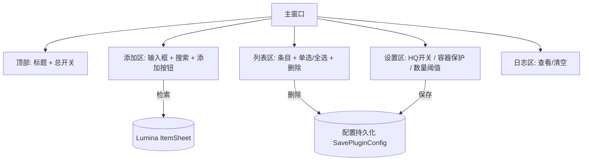

# 自动丢弃垃圾桶（Auto-Trash）插件 PRD

> 形态：**简单 PRD**（默认形态，不含竞品 / 市场分析）
> 角色：产品经理 许清楚（Xu）
> 适用团队：FFXIV Dalamud 插件开发组

## 项目信息

| 项 | 内容 |
|----|------|
| 语言 / 框架 | C# / .NET 10 / Dalamud API 15 / ImGui（覆盖默认 Web 栈） |
| 项目名 | `auto_trash_can`（snake_case） |
| 类型 | 全新独立插件（非增量） |
| 原始需求复述 | 用户维护一份「待丢弃物品列表」（按物品名 / ItemId 管理）；当列表内物品进入背包时**自动丢弃、无确认弹窗**；列表持久化保存（插件 / 游戏重启仍生效）；列表可随时新增 / 删除条目。 |

### Dalamud API 15 约定（来自工作区记忆，开发须遵守）
- 插件入口用 `[PluginService]` 静态属性注入服务（`IDalamudPluginInterface`、`IClientState`、`IInventoryManager` 等），构造函数无参。
- 配置持久化走 `IDalamudPluginInterface.GetPluginConfig<T>()` / `SavePluginConfig()`（Dalamud 自动序列化 JSON 到插件配置目录）。
- 窗口系统用 ImGui（`ImGuiScene` 在该 IL2CPP 版本不可用）。
- 背包 / 物品数据来自 Dalamud 服务与 Lumina（`ItemSheet` 查物品名 / Icon）。

---

## 1. 产品目标

**一句话目标**：让玩家彻底摆脱「背包被垃圾物品塞满」的困扰——指定物品一旦进包即被静默自动丢弃，零点击、零打扰。

**成功标准（可衡量）**
- 列表内物品进入背包后，在数秒内被自动丢弃，全程**不弹出任何确认对话框**（P0）。
- 插件 / 游戏重启后，列表与开关状态**完全保留**（P0）。
- 误丢率 = 0：受保护容器 / 受保护物品类型**绝不被丢弃**（P0）。
- 列表单条增 / 删操作可在 UI 内 3 步内完成（P1）。

---

## 2. 用户故事

| ID | 用户故事 |
|----|----------|
| US-1 | 作为日常刷本的玩家，我希望列表里的「破损的 xxx」进包即被丢弃，这样我不用每次手动清理背包。 |
| US-2 | 作为多角色玩家，我希望丢弃列表能持久化保存，这样重开游戏后规则依然生效，无需重新配置。 |
| US-3 | 作为谨慎的玩家，我希望有总开关和日志，这样我能随时关闭自动丢弃并核对「刚才丢了什么」。 |
| US-4 | 作为配置者，我希望能按物品名或 ItemId 添加 / 删除条目，这样不论物品是否本地化都能精确管理。 |
| US-5 | 作为安全敏感玩家，我希望公司仓库 / 军武库 / 关键任务物品受保护，这样自动丢弃绝不会误伤重要资产。 |

---

## 3. 需求池

### P0 — 必须实现（Must）

| ID | 需求 | 验收标准 |
|----|------|----------|
| P0-1 | 列表管理（增 / 删 / 查） | 提供 UI 入口，可按物品名或 ItemId 添加条目；列表逐条展示，支持单条删除；支持搜索 / 过滤。 |
| P0-2 | 自动丢弃执行 | 列表内物品出现在背包（可交易 / 主背包槽位）时触发丢弃，且**无任何确认弹窗**。 |
| P0-3 | 配置持久化 | 通过 `GetPluginConfig<T>()` / `SavePluginConfig()` 保存 / 加载列表与开关；重启生效。 |
| P0-4 | 总开关 | 提供全局启用 / 停用开关，关闭后完全不触发丢弃逻辑。 |
| P0-5 | 受保护容器保护 | 公司仓库 / 军武库等受保护容器内的物品**绝不**自动丢弃。 |

### P1 — 应该实现（Should）

| ID | 需求 | 验收标准 |
|----|------|----------|
| P1-1 | 操作日志 | 记录每次自动丢弃（物品名、数量、时间、所属背包），UI 内可查看、可清空。 |
| P1-2 | HQ 物品策略 | 默认**不丢弃 HQ 物品**（提供开关可选开启）。见待确认问题 Q3。 |
| P1-3 | 数量限制 | 支持「仅当数量 > N 时丢弃」或「只丢到剩 N 个」策略，避免清掉任务所需数量。 |
| P1-4 | 物品名模糊匹配 | 添加时支持按 Lumina `ItemSheet` 本地化名检索，降低手动输入 ItemId 门槛。 |

### P2 — 可选实现（Nice to have）

| ID | 需求 | 验收标准 |
|----|------|----------|
| P2-1 | 列表导入 / 导出 | 支持 JSON / CSV 导入导出，便于多机 / 多角色共享配置。 |
| P2-2 | 条目分组 / 标签 | 对列表条目打标签（如「采集垃圾」「副本掉落」），分组管理。 |
| P2-3 | 冷却 / 节流 | 限制单位时间丢弃次数，降低反作弊 / 服务器限流风险。 |

### 自动丢弃触发时机（关键语义 — 待架构确认）

- **现状**：Dalamud 提供背包变更事件（`IInventoryManager` / 背包事件钩子），但「无确认直接丢弃」需调用游戏内部丢弃函数或绕过确认逻辑，属**架构层决策**，PRD 不下技术结论。
- **推荐默认行为假设（供后续确认）**：采用「事件驱动 + 轻量轮询兜底」——监听背包变更事件，命中列表内物品即刻发起丢弃；同时每 ~1s 做一次轻量校验扫描，覆盖事件漏触发场景；丢弃动作集中在游戏安全帧 / 空闲态执行以降低风险。
- 最终触发机制与丢弃实现由架构师在架构阶段裁定。

---

## 4. UI 设计稿（主窗口）

### ASCII 布局

```
┌─────────────────────────────────────────────┐
│  🗑 Auto-Trash      [总开关: ●开 / ○关]        │
├─────────────────────────────────────────────┤
│  添加: [物品名 / ItemId 输入框......] [🔍搜索] [+ 添加] │
├─────────────────────────────────────────────┤
│  待丢弃列表 (共 N 条)          [搜索过滤: ____] │
│  ┌───────────────────────────────────────┐  │
│  │ ☑ 破损的石板        (ItemId: 20001) [删]│  │
│  │ ☑ 学徒之证          (ItemId: 31234) [删]│  │
│  │ ☐ 旧硬币            (ItemId: 10123) [删]│  │
│  └───────────────────────────────────────┘  │
│  全选 [✓]    批量删除 [🗑]                     │
├─────────────────────────────────────────────┤
│  设置:                                       │
│   ☑ 丢弃 HQ 物品（默认关）                    │
│   ☑ 保护公司仓库 / 军武库（默认开）            │
│   仅当数量 > [ 5 ] 时丢弃                      │
├─────────────────────────────────────────────┤
│  [📋 操作日志]   最近丢弃: 破损的石板 x3 @12:01 │
└─────────────────────────────────────────────┘
```

### Mermaid 信息架构



---

## 5. 待确认问题（Open Questions）

- **Q1 自动丢弃触发时机**：事件驱动 vs 定时扫描 vs 混合？推荐默认假设见需求池说明，待架构确认最终语义与性能 / 风险权衡。
- **Q2 确认绕过的安全性**：直接调用游戏内部丢弃函数是否存在封号 / 反作弊风险？是否需要节流、延迟、安全态判断？
- **Q3 HQ / 特定品质物品**：默认是否丢弃 HQ 物品？是否区分 Collectable / 染色 / 可交易状态？
- **Q4 跨容器与特殊背包**：除公司仓库 / 军武库外，陆行鸟鞍袋、寄送箱、豪华武具库、深潜 / 海岛仓库等是否需保护？是否需要全部保护？
- **Q5 数量与堆叠策略**：默认「见即丢」还是「保留 N 个」？任务 / 收藏所需数量如何避免被清？
- **Q6 失败与边界处理**：物品处于不可丢弃状态（绑定中、装备中、邮寄中）时如何处理？丢弃失败是否重试、是否记录？
